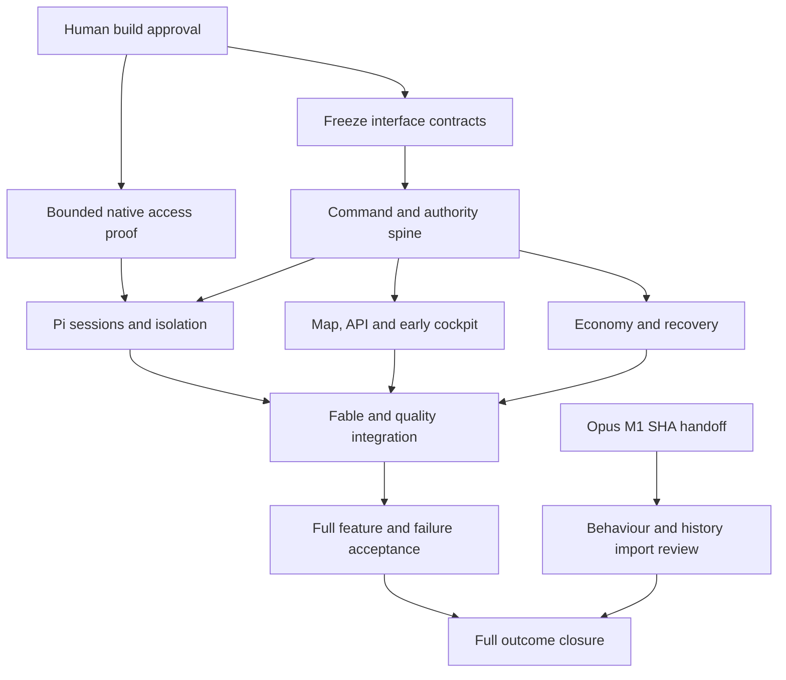

# Helm 3 Map — preparation snapshot

Snapshot: 2026-09-15. GitHub issues and native dependencies are authoritative. This document is a readable proposed Map, not runtime state or a fixed workflow.

Parent: [MAP #1](https://github.com/Nicegarrry/helm3/issues/1). Build approval: [APPROVAL #2](https://github.com/Nicegarrry/helm3/issues/2). Predecessor handoff: [HANDOFF #3](https://github.com/Nicegarrry/helm3/issues/3).

Product issues remain proposed. Independent preparation is authorised. No model run, merge or spending authority follows from a ticket being open or unblocked.

| Issue | Outcome | Blocked by |
| --- | --- | --- |
| [MAP #1](https://github.com/Nicegarrry/helm3/issues/1) | Outcome: Helm 3 durable autonomous development control plane | None; scope still applies |
| [APPROVAL #2](https://github.com/Nicegarrry/helm3/issues/2) | Record human approval of Brief and proposed Map | None; scope still applies |
| [HANDOFF #3](https://github.com/Nicegarrry/helm3/issues/3) | Receive immutable Helm CLI Milestone 1 handoff | None; scope still applies |
| [FREEZE #4](https://github.com/Nicegarrry/helm3/issues/4) | Freeze current-spec contracts and build deltas | [APPROVAL #2](https://github.com/Nicegarrry/helm3/issues/2) |
| [ACCESS #5](https://github.com/Nicegarrry/helm3/issues/5) | Prove bounded live Pi and Fable model access | [APPROVAL #2](https://github.com/Nicegarrry/helm3/issues/2) |
| [KERNEL #6](https://github.com/Nicegarrry/helm3/issues/6) | Persist commands, events, attempts and uncertain effects | [APPROVAL #2](https://github.com/Nicegarrry/helm3/issues/2), [FREEZE #4](https://github.com/Nicegarrry/helm3/issues/4) |
| [AUTHORITY #7](https://github.com/Nicegarrry/helm3/issues/7) | Enforce leases, reserve and refusal classes | [APPROVAL #2](https://github.com/Nicegarrry/helm3/issues/2), [KERNEL #6](https://github.com/Nicegarrry/helm3/issues/6) |
| [ECONOMY #8](https://github.com/Nicegarrry/helm3/issues/8) | Expose model registry, pools and honest resource reality | [APPROVAL #2](https://github.com/Nicegarrry/helm3/issues/2), [KERNEL #6](https://github.com/Nicegarrry/helm3/issues/6) |
| [CALIBRATION #9](https://github.com/Nicegarrry/helm3/issues/9) | Measure calibration and accepted-outcome metrics | [APPROVAL #2](https://github.com/Nicegarrry/helm3/issues/2), [ECONOMY #8](https://github.com/Nicegarrry/helm3/issues/8) |
| [WORKSPACE #10](https://github.com/Nicegarrry/helm3/issues/10) | Isolate worktrees and enforce writer ownership | [APPROVAL #2](https://github.com/Nicegarrry/helm3/issues/2), [KERNEL #6](https://github.com/Nicegarrry/helm3/issues/6) |
| [PI-SLICE #11](https://github.com/Nicegarrry/helm3/issues/11) | Prove Pi-native worker lifecycle vertical slice | [APPROVAL #2](https://github.com/Nicegarrry/helm3/issues/2), [AUTHORITY #7](https://github.com/Nicegarrry/helm3/issues/7), [WORKSPACE #10](https://github.com/Nicegarrry/helm3/issues/10), [ACCESS #5](https://github.com/Nicegarrry/helm3/issues/5) |
| [PI-EXTENSION #12](https://github.com/Nicegarrry/helm3/issues/12) | Control Pi tools and native session operations | [APPROVAL #2](https://github.com/Nicegarrry/helm3/issues/2), [PI-SLICE #11](https://github.com/Nicegarrry/helm3/issues/11) |
| [CONTEXT #13](https://github.com/Nicegarrry/helm3/issues/13) | Manage context lifecycle, compaction and model change | [APPROVAL #2](https://github.com/Nicegarrry/helm3/issues/2), [PI-EXTENSION #12](https://github.com/Nicegarrry/helm3/issues/12) |
| [EXTERNAL #14](https://github.com/Nicegarrry/helm3/issues/14) | Track narrow external cognition contracts | [APPROVAL #2](https://github.com/Nicegarrry/helm3/issues/2), [KERNEL #6](https://github.com/Nicegarrry/helm3/issues/6), [AUTHORITY #7](https://github.com/Nicegarrry/helm3/issues/7), [ECONOMY #8](https://github.com/Nicegarrry/helm3/issues/8) |
| [MAP-TRACKER #15](https://github.com/Nicegarrry/helm3/issues/15) | Operate a GitHub-backed fluid Map and closure predicate | [APPROVAL #2](https://github.com/Nicegarrry/helm3/issues/2), [KERNEL #6](https://github.com/Nicegarrry/helm3/issues/6) |
| [FABLE #16](https://github.com/Nicegarrry/helm3/issues/16) | Run Fable through typed Helm control-plane tools | [APPROVAL #2](https://github.com/Nicegarrry/helm3/issues/2), [KERNEL #6](https://github.com/Nicegarrry/helm3/issues/6), [AUTHORITY #7](https://github.com/Nicegarrry/helm3/issues/7), [ECONOMY #8](https://github.com/Nicegarrry/helm3/issues/8), [MAP-TRACKER #15](https://github.com/Nicegarrry/helm3/issues/15), [PI-SLICE #11](https://github.com/Nicegarrry/helm3/issues/11), [ACCESS #5](https://github.com/Nicegarrry/helm3/issues/5) |
| [SUPERVISOR #17](https://github.com/Nicegarrry/helm3/issues/17) | Reconcile deterministically and coalesce judgement wakes | [APPROVAL #2](https://github.com/Nicegarrry/helm3/issues/2), [AUTHORITY #7](https://github.com/Nicegarrry/helm3/issues/7), [PI-SLICE #11](https://github.com/Nicegarrry/helm3/issues/11), [MAP-TRACKER #15](https://github.com/Nicegarrry/helm3/issues/15) |
| [REASONING #18](https://github.com/Nicegarrry/helm3/issues/18) | Choose dynamic review and alternative cognitive approaches | [APPROVAL #2](https://github.com/Nicegarrry/helm3/issues/2), [FABLE #16](https://github.com/Nicegarrry/helm3/issues/16), [EXTERNAL #14](https://github.com/Nicegarrry/helm3/issues/14), [CONTEXT #13](https://github.com/Nicegarrry/helm3/issues/13) |
| [QUALITY #19](https://github.com/Nicegarrry/helm3/issues/19) | Run gates, independent review and repair against acceptance | [APPROVAL #2](https://github.com/Nicegarrry/helm3/issues/2), [PI-SLICE #11](https://github.com/Nicegarrry/helm3/issues/11), [MAP-TRACKER #15](https://github.com/Nicegarrry/helm3/issues/15) |
| [INTEGRATION #20](https://github.com/Nicegarrry/helm3/issues/20) | Prepare and merge only exact fresh evidence | [APPROVAL #2](https://github.com/Nicegarrry/helm3/issues/2), [QUALITY #19](https://github.com/Nicegarrry/helm3/issues/19), [AUTHORITY #7](https://github.com/Nicegarrry/helm3/issues/7) |
| [CLIENTS #21](https://github.com/Nicegarrry/helm3/issues/21) | Expose shared API through CLI and local cockpit | [APPROVAL #2](https://github.com/Nicegarrry/helm3/issues/2), [KERNEL #6](https://github.com/Nicegarrry/helm3/issues/6), [MAP-TRACKER #15](https://github.com/Nicegarrry/helm3/issues/15), [ECONOMY #8](https://github.com/Nicegarrry/helm3/issues/8) |
| [IMPORT #22](https://github.com/Nicegarrry/helm3/issues/22) | Classify and import approved Milestone 1 behaviour | [APPROVAL #2](https://github.com/Nicegarrry/helm3/issues/2), [HANDOFF #3](https://github.com/Nicegarrry/helm3/issues/3), [KERNEL #6](https://github.com/Nicegarrry/helm3/issues/6) |
| [ACCEPTANCE #23](https://github.com/Nicegarrry/helm3/issues/23) | Prove the complete autonomous feature scenario | [APPROVAL #2](https://github.com/Nicegarrry/helm3/issues/2), [FABLE #16](https://github.com/Nicegarrry/helm3/issues/16), [SUPERVISOR #17](https://github.com/Nicegarrry/helm3/issues/17), [QUALITY #19](https://github.com/Nicegarrry/helm3/issues/19), [INTEGRATION #20](https://github.com/Nicegarrry/helm3/issues/20), [CLIENTS #21](https://github.com/Nicegarrry/helm3/issues/21), [CALIBRATION #9](https://github.com/Nicegarrry/helm3/issues/9), [PI-EXTENSION #12](https://github.com/Nicegarrry/helm3/issues/12), [CONTEXT #13](https://github.com/Nicegarrry/helm3/issues/13), [EXTERNAL #14](https://github.com/Nicegarrry/helm3/issues/14), [REASONING #18](https://github.com/Nicegarrry/helm3/issues/18) |
| [LEGACY #24](https://github.com/Nicegarrry/helm3/issues/24) | Retire legacy worker path after Pi-native proof | [APPROVAL #2](https://github.com/Nicegarrry/helm3/issues/2), [ACCEPTANCE #23](https://github.com/Nicegarrry/helm3/issues/23), [IMPORT #22](https://github.com/Nicegarrry/helm3/issues/22) |
| [OUTCOME-CLOSURE #25](https://github.com/Nicegarrry/helm3/issues/25) | Close Helm 3 outcome against Brief and legacy evidence | [APPROVAL #2](https://github.com/Nicegarrry/helm3/issues/2), [ACCEPTANCE #23](https://github.com/Nicegarrry/helm3/issues/23), [LEGACY #24](https://github.com/Nicegarrry/helm3/issues/24), [IMPORT #22](https://github.com/Nicegarrry/helm3/issues/22) |
| [PREP #26](https://github.com/Nicegarrry/helm3/issues/26) | Prepare independent private repository, Brief, Map and SDK evidence | None; scope still applies |

## Proposed parallel approach

The detailed issue graph is the dependency authority. This overview omits edges for readability. Three workers plus coordinator is a proposed initial capacity, not an entitlement. The full design remains in [design-source.md](design-source.md); see [coverage.md](coverage.md) and [build-plan.md](build-plan.md).
